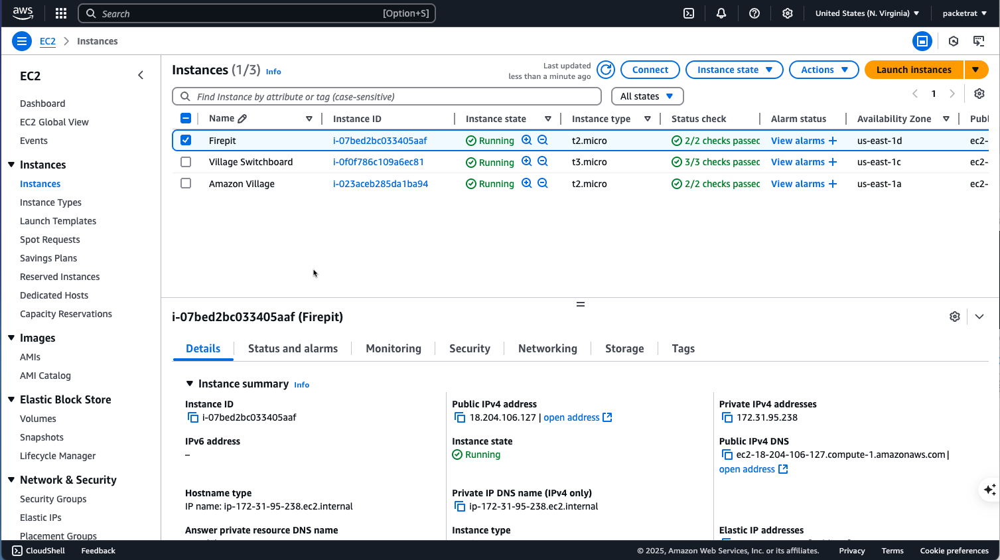

# OCA Interoperability Village

  

## Introduction

The cybersecurity landscape's constant evolution calls for robust, dynamic solutions that enable seamless interoperability between various tools and frameworks. The cybersecurity field is increasingly complex, necessitating a dedicated platform for interoperability testing of diverse tools and frameworks. The existence of a persistent, community-driven Interoperability Village lets us incrementally build on our prior successes and extend and maintain integrations.

A centrally provisioned, distributed, interoperability lab lets organizations participate without the constraints of extending their internal infrastructure and data to external parties. Without a neutral decoupled space for testing interoperability, organizations will continue to operate in silos which will prevent progress. An interoperability lab will significantly increase the speed at which testing can occur, leading to faster results.

The Interoperability Village meets this critical need, fostering collaboration and shared learning among OCA stakeholders, and contributing to enhanced cybersecurity interoperability. This approach will also strengthen standards development as feedback derived from concrete implementations and interoperability testing can provide valuable insights and recommendations.

## Project Overview

The  Interoperability Village <Interoperability Village> is a sub-project of [Open Cybersecurity Alliance (OCA)](https://opencybersecurityalliance.org/) that facilitates the core objectives of the [OCA Cyber Automation Sub Project](https://opencybersecurityalliance.org/casp/). The OCA CASP is a forum where products from all vendors, researchers, and software publishers can freely exchange information, insights, and reference implementations via commonly developed code and tooling, using mutually agreed upon technologies, specifications, and procedures.

To further these objectives, we have established the **Interoperability Village (IoV) ** - a dynamic distributed architecture that enables interoperability testing between between a diverse set of stakeholders.

### Project Use Case 
The 'Interoperability Village' shall act as a testing ground for stakeholders of the OCA to perform comprehensive interoperability testing between OASIS Open Projects', Open Source, and Commercial cybersecurity tools and frameworks. The village will be a persistent distributed architecture funded/resourced by individual sponsors and centrally provisioned using volunteer technical resources.  
* IoV provides an interoperabiility environment that is solated from stakeholder internal development, testing, and production systems/data where elements can be more readily provisioned and interconnected outside of the requisite internal controls.  
* This isolation from internal assets will empower rapid prototyping and iterations outside of formal internal processes, procedures, and policies controlling internal assets.
* The ability to persist test data, functional elements, and integration progress to date will allow us to focus on next steps vs. re-creating same to re-test.
* The ability to quickly 'lash-up' one-off, ephemeral 'Villages' facilitates rapid protyping and ideation.

### Core Objectives
The core objectives of this architecture are:

* Persistence
* Flexibility
* Low cost (centrally and individual particpants)
* Minimal support staff requirements
* Centralized provisioning
* Highly distributed elements
* Relative simplicity 
* Agility
* Risk comensurate security architecure
* On-demand Lash-Ups/Tear-Downs
* Multiple concurrent topologies 

## Mesh Architecture

The IoV foundational architecture and concepts are based on [MeshCentral](https://meshcentral.com/) authored by [Ylian Saint-Hilaire](linkedin.com/in/ylianst). MeshCentral delivers all of the functional elements required to meet the above core objectives.

  

### AWS Centralized Provisioning
The Interoperability Village "Town Council" and "Zoning Commision" operate on a centralized instatiation of MeshCentral on AWS.  The minimal cloud footprint of MeshCentral server minimizes costs. 

  

The "Town Council" will operate at the policy level and the "Zoning Commission" will serve to approve the creation of a new "Neighborhood" and additional of "Huts"

* Participants request the creation of a "Neighborhood" and the "Huts" you want to build. You provide your external public facing IP address for access to IOV MeshCentral and we provide you with an Agent Provisioning script that you run on each "Hut" you wish to add to your "Neighborhood".
### IoV Neighborhoods

IoV **Neighborhoods** represent an participating member's collection of systems, containers, etc.  Some analagous concepts are an 'enclave', a 'subnet'

### Building your 'Huts'

Your "Neighborhood' consists of 'Huts' you provision, build, and manage.  'Huts'can be constructed using an a $80 Raspberry PI or a cluster of $500K servers. You want to bring a cluster of NVDIA RTX Blackwells? -- Welcome To The Party!

You provide the IP ACL source address for your external facing interfaces and we provide an Agent that you deploy on as many systems as you wish.

#### Raspberry PI Clusters
We have had great success with the build-out of Raspberry Pi 5 clusters using 16GB Pi5s, NVMe SSDs, and 5TB SATA drives.  We have successfully deployed fully functiuonal instances of [MISP](https://www.misp-project.org/), [OpenCTI](https://filigran.io/solutions/open-cti/), [OpenBAS](https://filigran.io/solutions/open-bas/), [Elastic Stack](https://www.elastic.co/blog/getting-started-with-the-elastic-stack-and-docker-compose), and dozens of [Connectors](https://docs.opencti.io/latest/deployment/connectors/) using Docker containers.

This methodolgy empowers the automated construction of fully functional distributed instantions of all the elements you need to model and test.  Need to add a new 'shiny object'?  If it has a Docker container you can add it to your lab! Obviously, instantiations need to be sized to demands:  if you want to test full packet-capture, deep-packet-inspection, and flow-analysis at 10GB

For those wishing to duplicate our successes we will provide software and hadware bills-of materials (HBOM/SBOM)that you can copy or adjust for your needs.  We will also provide forums for the collection and sharing of SBOMs/HBOMs, IaaS, SaaS, DevOps, SecOps.  The core Team will be focused and evangelizing Docker, Docker Swarm, Ansible, and MeshCentral compatible architectures

You can just as easily deploy your frameworks on cloud (AWS, Google, Azure, IBM. Oracle), on-prermise servers/containers, home labs, etc.   You provide your perimter Public IP and we provide a script to deploy the MeshCentral Agent on each 'Hut' in your 'Neighborhood'

### MeshCentral Resources
(https://meshcentral.com/downloads.html)

## License

This project is licensed under the Apache 2.0 License - see the [LICENSE.md](./LICENSE.md) file for details

#### Methods and strategies 
To ensure the success of the 'Interoperability Village,' we will implement the following strategy:

* Stakeholder Engagement: Continuous engagement with OCA stakeholders to understand their needs and incorporate their feedback into the project.

* Sponsor Outreach: Active outreach to potential sponsors, showcasing the value proposition of the 'Interoperability Village' and how their contribution can make a significant impact.

* Volunteer Recruitment: Harnessing the expertise of the cybersecurity community through a call for volunteer technical resources. The recruitment process will focus on the skills necessary for the project.

* Progress Tracking: Regular updates to the OCA Leadership Board and sponsors about the project's progress, maintaining transparency and trust.

* Quarterly Interoperability Plugfests:  the OCA CASP working group holds quarterly interoperability conferences that brings together practitioners and stakeholders to establish and demonstrate interoperability of tools and framework built using cybersecurity and related data standards.

### List the current project maintainers, and their Github user IDs

Patrick Maroney  packet-rat  

