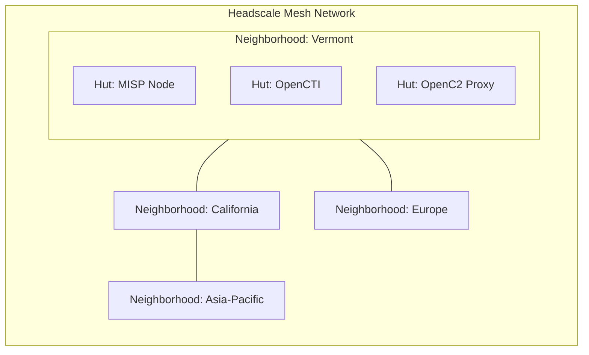

  

# 🏘️ OCA Interoperability Village

> A distributed, community-driven lab for testing and proving interoperability across open, commercial, and emerging cybersecurity tools and frameworks.

---

Welcome to the **Interoperability Village**, an Open Cybersecurity Alliance (OCA) initiative. Our mission is to accelerate the adoption and interoperability of open cybersecurity standards by building a distributed testbed for tools, frameworks, and research prototypes.

---

## 🌐 What is Interoperability Village?

Interoperability Village is a **federated ecosystem of virtual test labs**—called **Neighborhoods**—interconnected over secure, decentralized virtual networks. Within each Neighborhood, participants can spin up modular environments called **Huts**, where individual tools and platforms are deployed, integrated, and tested together.

We support OCA standards and beyond, including:

- STIX 2.1 / TAXII
- OpenC2
- CACAO / MISP / Threat Bus
- SBOMs (SPDX, CycloneDX)
- OpenTelemetry, Kestrel, IoB, and more

---

## 🚀 Project Overview

The **Interoperability Village (IoV)** is a sub-project of the [Open Cybersecurity Alliance (OCA)](https://opencybersecurityalliance.org/), under the **Cyber Automation Sub-Project (CASP)**. It serves as a vendor-neutral playground for:

- Open source tools  
- Commercial cybersecurity frameworks  
- Reference implementations of emerging standards  

Our mission: **enable real-world, hands-on interoperability testing** through a flexible, distributed, and community-supported lab architecture.

---

## 🎯 Core Objectives

- 🔁 **Persistence** – Retain knowledge, data, and tooling across iterations  
- 🧩 **Flexibility** – Raspberry Pi to high-end clusters—build your lab your way  
- 💸 **Low Cost** – Minimal infrastructure and support overhead  
- ☁️ **Centrally Provisioned** – MeshCentral on AWS for global reach  
- 🏗️ **Ephemeral Labs** – Spin up one-off "Villages" on demand  
- 🔐 **Risk-Commensurate Security** – Segmented, external-only access  
- 🕸️ **Mesh Architecture** – Distributed, scalable, and resilient  

---

## 🧪 Key Use Cases

- Test integrations between **OASIS standards**, open-source, and commercial tools  
- Develop and refine **reference implementations**  
- Host **quarterly Plugfests** for live collaboration and demonstration  
- Provide a **safe, isolated, disposable** testing environment for rapid prototyping  

> ⚙️ *Build. Break. Iterate. Interoperate.*

## 🧱 Architecture Overview

Each participant connects through a **Headscale-powered decentralized Tailscale network**, enabling seamless and secure Layer 3 connectivity across disparate environments without needing to expose public IPs or configure firewalls.

## 🏡 Architecture: "The Village"

### 🧱 Neighborhoods & Huts

- A **Neighborhood** is your logical domain (lab, subnet, enclave).  
- A **Hut** is any system, VM, container, or device you provision.  
- From a $80 Raspberry Pi to a fleet of NVIDIA RTX Blackwell nodes—**bring what you've got**.

You bring your **public IP and ACL**, we provide an **Agent Provisioning Script**. That’s it.

---
## 🧰 Hardware & Tooling

We've had excellent results using:

- **Raspberry Pi 5** (16GB RAM) with NVMe SSD + 5TB SATA  
- **Docker** for container orchestration  
- **Ansible** for provisioning  
- **MeshCentral** for remote control and central coordination  

### Supported Frameworks

- [MISP](https://www.misp-project.org/)  
- [OpenCTI](https://www.opencti.io/)  
- [Elastic Stack](https://www.elastic.co/)  
- [OpenBAS](https://www.openbas.io/)  
- Dozens of **Connectors** and integrations  

> If it runs in a Docker container, it runs in IoV.

---

### ✅ Key Components

- **Headscale**: Self-hosted coordination server for WireGuard-based Tailscale nodes. Replaces MeshCentral.
- **Neighborhood**: A logically grouped set of Huts managed by a participant or organization.
- **Hut**: A single-purpose VM, container, or node running an open cybersecurity platform or tool.

### 🔒 Why Headscale?

- Fully open source and self-hostable
- Peer-to-peer encrypted using WireGuard
- Supports ephemeral or long-lived keys for zero-trust overlays
- No cloud dependencies

---

## 🧰 Core Use Cases

- ✅ Validate tool interoperability in real-time
- ✅ Run collaborative experiments with shared data models
- ✅ Demonstrate threat intelligence sharing across platforms
- ✅ Simulate attack chains across federated tools

---

## 🛠️ How to Participate

### 🏘️ Request a Neighborhood

Want to run your own Interoperability Village site?

Submit a GitHub issue or email [interoperability@opencybersecurityalliance.org](mailto:interoperability@opencybersecurityalliance.org) with:

<pre>
name: "My Neighborhood Name"
organization: "Org Name (if applicable)"
maintainer: "Your Name and GitHub Handle"
use_case: "Short description of your tools or focus (e.g., OpenCTI and OpenC2 translation)"
preferred_location: "Optional - e.g., AWS us-east-1, self-hosted, etc."
</pre>

We will provision:

- A Headscale identity and pre-authorized device keys
- A `neighborhood.yml` manifest template for your infrastructure
- Optionally, a starter Terraform/Ansible config for bootstrapping

### 🛖 Request a Hut

Already part of a Neighborhood and want to spin up a new Hut?

You can:

- Fork and contribute a Hut spec under `huts/<your-name>/<tool-name>`
- Or request one via an issue or pull request

**Example Hut types**:

- `huts/misp/threat-intel-node`
- `huts/opencti/signal-ingest`
- `huts/openc2/firewall-orchestrator`

---
---

## 🤝 Join the Conversation

Let’s build the future of cybersecurity—together. You can join the OCA Interoperability Village mailing list by sending an empty email to [oca-interop-village+subscribe@lists.oasis-open-projects.org ](mailto:oca-interop-village+subscribe@lists.oasis-open-projects.org).

You can join the OCA Slack [via this link](https://join.slack.com/t/open-cybersecurity/shared_invite/zt-1jsgt1053-oYsfBPXXChhbRO4JO5Xo1A). There is a #interoperability-village channel :).

### List the current project maintainers, and their Github user IDs

Patrick Maroney  packet-rat  
---

## 🗓️ Community Engagement

To grow the Village, we focus on:

- 🤝 **Stakeholder Engagement** – Incorporating OCA community feedback  
- 💼 **Sponsor Outreach** – Demonstrating value to funders and backers  
- 🧑‍💻 **Volunteer Recruitment** – Tapping the talent of the security ecosystem  
- 📈 **Progress Transparency** – Frequent updates to the OCA leadership & sponsors  
- 🔌 **Quarterly Plugfests** – Real-world demos with stakeholders, tools, and standards  

---

## 📜 License

This project is licensed under the **Apache 2.0 License**.  
See [LICENSE.md](LICENSE.md) for full terms.

---

## 🧭 Get Involved

### 🔧 Ready to Build a Neighborhood?

> Drop your public IP and request your provisioning script!

Build your 'Huts', test your tools, and join a growing community shaping the future of cybersecurity interoperability.

---

## 📈 Provisioning Flow

---

## 🧪 Testbed Topology

## 🌐 Introduction

The **Interoperability Village** answers a critical need in cybersecurity: **a persistent, neutral, and flexible environment to test and validate interoperability** between diverse tools and frameworks.

In an era of increasingly complex security ecosystems, no single tool can stand alone. **Interoperability is essential**—and yet testing often happens in isolation, constrained by proprietary infrastructure and limited collaboration.

This project breaks down those silos.

---

---

## 🧪 Plug-and-Play Testing

- 🔄 Rapid prototyping outside internal security gates  
- ⏱️ Quick spin-up/tear-down cycles  
- 🧬 Persistent test states for iterative development  
- ☁️ Deploy anywhere: home lab, cloud, enterprise  

## 🔗 MeshCentral Resources

- [MeshCentral Downloads](https://meshcentral.com/downloads.html)  
- [MeshCentral GitHub](https://github.com/Ylianst/MeshCentral)  

